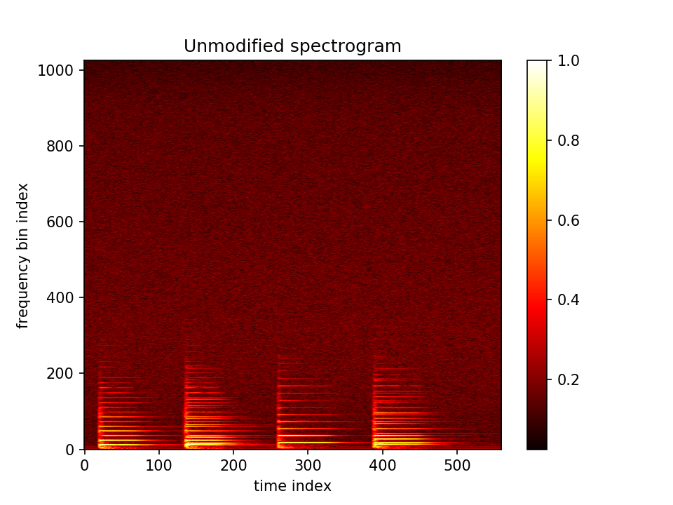
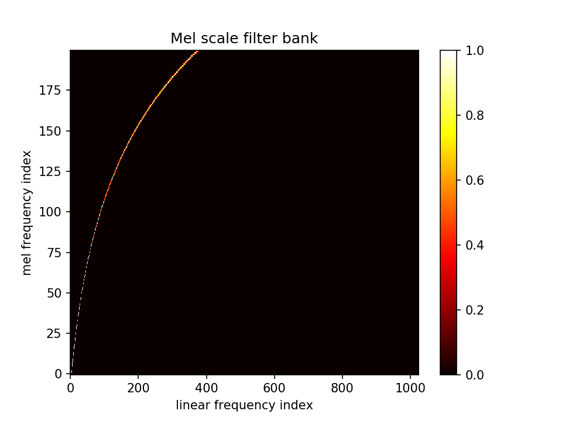
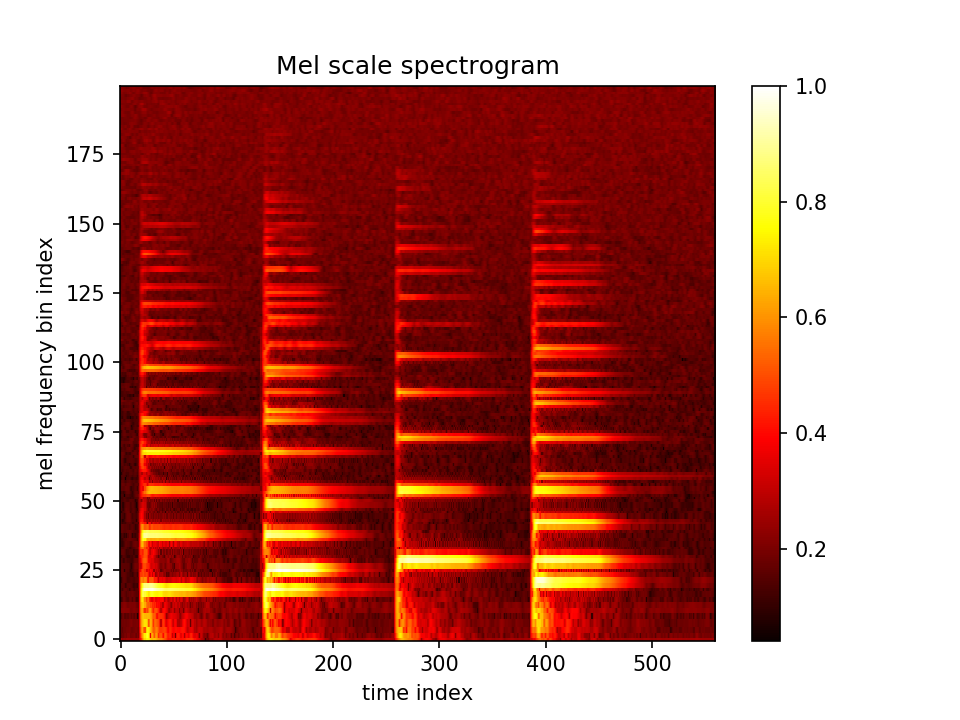
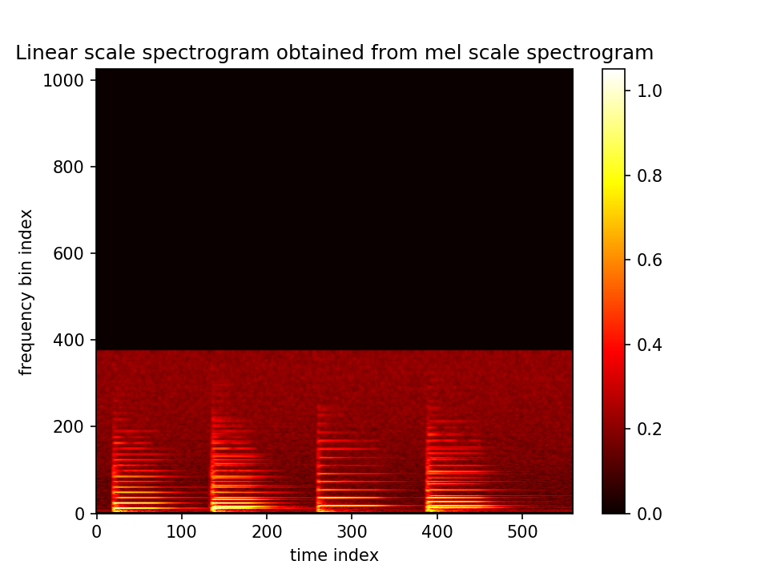

###### 'fork' from https://github.com/bkvogel/griffin_lim
# griffin_lim
Python implementation of the Griffin and Lim algorithm to recover an audio signal from a magnitude-only spectrogram.

##### Description

This is a python implementation of Griffin and Lim's algorithm to recover an audio signal given only the magnitude of its Short-Time Fourier Transform (STFT), also known as the spectrogram. The Griffin and Lim method is described in the paper:

Griffin D. and Lim J. (1984). "Signal Estimation from Modified Short-Time Fourier Transform". IEEE Transactions on Acoustics, Speech and Signal Processing. 32 (2): 236–243. doi:10.1109/TASSP.1984.1164317

This is an iterative algorithm that attempts to find the signal having an STFT such that the magnitude part is as close as possible to the modified spectrogram.

The Griffin and Lim algorithm can be useful in an audio processing system where an audio signal is transformed to a spectrogram which is then modified or in which an algorithm generates a synthetic spectrogram that we would like to "invert" into an audio signal.

#### Requirements

Requires Python 3 (tested with Anaconda Python 3.6 distribution)

#### Usage

The provided code shows an example usage of the Griffin and Lim algorithm. It loads an audio file, computes the spectrogram, optionally performs low-pass filtering by zeroing all frequency bins above some cutoff frequency, and then uses the Griffin and Lim algorithm to reconstruct an audio signal from the modified spectrogram. Finally, both the reconstructed audio signal and the spectrogram plot figure are saved to a file.

A short audio clip, `bkvhi.wav`,  of a few piano notes is provided that can be used as the input signal. To run the example:

```
python run_demo.py
```

There are several optional command-line arguments. See `run_demo.py` for details.

For example, to enable a low-pass filter with a cutoff frequency of 1000 Hz:

```
python run_demo.py --enable_filter --cutoff_freq 1000
```

##### Mel scale spectrogram example

The default STFT-based spectrogram uses a linear frequency scale since the FFT bins are uniformly spaced between DC and the Nyquist frequency. For some applications it can also be useful or interesting to transform to the [mel scale](https://en.wikipedia.org/wiki/Mel_scale). The mel scale is a perceptually motivated scale that is logarithmic in frequency. The mel scale spectrogram will be computed if the `--enaable_mel_scale` argument is supplied:

```
python run_demo.py --enable_mel_scale
```

This will read the default or supplied audio file as before and first compute the STFT-based spectrogram:



A mel frequency filter bank matrix is then created. The filter bank is created by the function `audio_utilities.make_mel_filterbank()` which is called from `run_demo()`. We can control the resolution and frequency range of the filterbank by adjusting the three parameter varables `min_freq_hz`, `max_freq_hz`, and `mel_bin_count`.

Mel scale filter bank:


If `stft_mag` contains the (linear frequency scale) spectrogram, then we can obtain by mel scale spectrogram as follows:

```
mel_spectrogram = np.dot(filterbank, stft_mag.T)
```

Note that since `stft_mag` contains the spectral time slices as its rows, we need to take the transpose. This results in the following mel frequency spectrogram:



Comparing the linear and mel scale spectrograms, we notice that the mel scale representation distributes the energy more uniformly and also has fewer bins than the linear representation.

It is interesting to consider performing the spectral modifications on the mel scale spectrogram and then transforming back to the linear frequency spectrogram and applying the Griffin and Lim algorithm to reconstruct the audio. Since this is a lossy transformation, there will be some degradation in audio quality depending on the filter bank parameters, however.

The `run_demo()` example does not perform any modification and simply transforms the mel scale spectrogram back to the linear representation using

```
inverted_mel_to_linear_freq_spectrogram = np.dot(filterbank.T, mel_spectrogram)
```

which results in the following linear frequency spectrogram:



Note that depending on the mel filter bank parameters, the extreme low and high frequencies will be 0 and there will also be some distortion in the mid-range. Finally, the Griffin Lim algorithm is applied to this (magnitude) spectrogram to reconstruct an audio file `out.wav`.

It can be interesting to experiment with different filter bank parameters and iteration counts and listen to the resulting output audio files.

Regarding the number of iterations, a small number such as 50 is good for quick runs but will probably result in some audible artifacts. For high quality output, it is suggested to run for 1000 iterations or more.

#### License

FreeBSD license.
